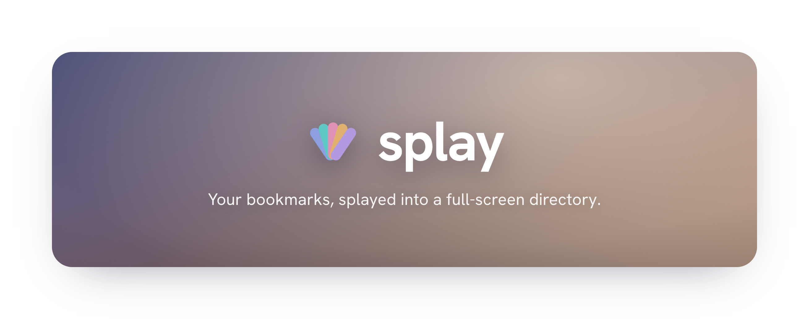

<p align="center">
  
</p>

Splay replaces your Chrome new tab with a dense, categorized, multi‑column directory of all your bookmarks — synced in real time.

Not a speed dial. Not a bookmark manager. A web directory, built from what you already have.

## Why

Chrome gives you two ways to see bookmarks: a single‑row toolbar, or a single‑column dropdown. Both collapse under scale. If you have hundreds of bookmarks organized into folders, you deserve a view that shows all of them at once.

Splay reads your Chrome bookmarks and renders them as a full‑screen directory — every folder becomes a section, every bookmark a compact link. One screen, everything visible.

## Install

### From source (development)

```bash
git clone https://github.com/user/splay.git
cd splay
npm install
npm run build
```

1. Open `chrome://extensions`
2. Enable **Developer mode**
3. Click **Load unpacked**
4. Select the `dist/` folder

For fast UI iteration, `npm run dev` serves the new tab page at
`http://localhost:5173/newtab.html` with mock bookmark data (the
`chrome.bookmarks` API is only available inside the loaded extension).

### From Chrome Web Store

Coming soon.

## How it works

```
Your Chrome bookmarks             What you see in Splay
─────────────────────────          ──────────────────────

Bookmarks Bar/                     ┌─────────────────────────────────┐
├── Google           ──────────►   │ 📌 Bookmarks Bar                │
├── GitHub                         │ Google  GitHub  Gmail  YouTube  │
├── Gmail                          └─────────────────────────────────┘
├── YouTube
│                                  ┌─ Dev Tools ──┐ ┌─ Design ──────┐
├── Dev Tools/       ──────────►   │ MDN  CodePen │ │ Figma  Dribb… │
│   ├── MDN                        │ ▶ Frontend   │ │ ▶ Icons       │
│   ├── CodePen                    │ ▶ Backend    │ │ ▶ Colors      │
│   └── Frontend/                  └──────────────┘ └───────────────┘
│       ├── React
│       └── Vue                    ─────────────────────────────────
│                                  ┌─ 📁 Other Bookmarks ───────────┐
├── Design/          ──────────►   │ Wikipedia  Archive.org          │
│   └── ...                        │ ▶ Read Later                    │
│                                  └─────────────────────────────────┘
Other Bookmarks/     ──────────►
├── Wikipedia
└── Read Later/
```

## Tech

- Chrome Extension (Manifest V3)
- React + TypeScript
- Vite (build)
- Zero runtime dependencies beyond React

## Contributing

Contributions welcome. See [CONTRIBUTING.md](CONTRIBUTING.md) for development setup and guidelines.

## License

MIT
